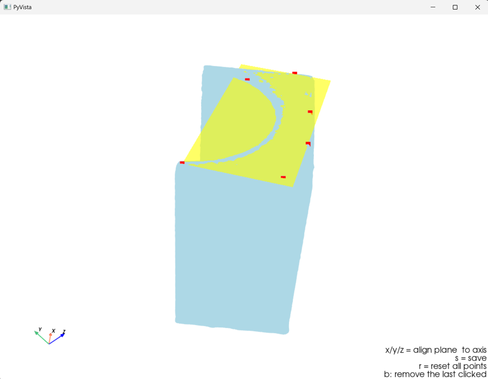

# Align Mesh to Origin Coordinates

## Overview

This script allows you to load your mesh and align it with the origin coordinates. It's a handy tool for those who work in reverse engineering, or any field that requires precise mesh alignment.

## Prerequisites

To use this script, you must have Python installed on your computer along with the following libraries:

```shell
pip install numpy pyvista scipy scikit-learn
```

## Usage Instructions

1. Rename your mesh file to `input_mesh.ply`.

2. Execute the script. Begin by selecting points on the mesh to define the alignment plane. You need to pick at least three points for accurate alignment.

3. Use the keys `x`, `y`, or `z` to align the selected plane with the corresponding axis of the world coordinate system.

4. Press the 's' key to save the aligned mesh as `transformed_mesh.stl`.

## Screenshot

Here's a screenshot to help you visualize the process:


